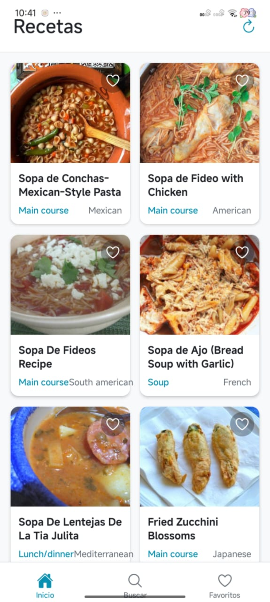

# Resetario - App de Recetas de Cocina

## 1. Identificación del Proyecto

- **Nombre de la App:** Resetario
- **Asignatura/Profesor:** Desarrollo de Aplicaciones Móviles / M.C. Leonel González Vidales
- **Periodo/Fecha:** Septiembre 2025
- **URL del Repositorio:** https://github.com/l3onet/resetario

## 2. Descripción del Proyecto

Resetario es una aplicación móvil desarrollada con React Native, Expo y TypeScript que permite a los usuarios explorar, buscar y gestionar recetas de cocina mediante una interfaz intuitiva. La aplicación integra la API de Edamam para obtener recetas reales y cuenta con un sistema de favoritos persistente usando AsyncStorage.

### Características Principales:

- 📱 **Exploración de Recetas:** Lista de recetas aleatorias con información detallada
- 🔍 **Búsqueda de Recetas:** Búsqueda en tiempo real por nombre
- ❤️ **Sistema de Favoritos:** Guarda tus recetas favoritas localmente
- 📋 **Detalles Completos:** Vista detallada con ingredientes, instrucciones y nutrición
- 🎨 **Interfaz Moderna:** Diseño limpio con navegación por pestañas
- 🌐 **API Externa:** Integración con Edamam API para recetas reales

### Funcionalidades Implementadas:

- Navegación por pestañas (Home, Buscar, Favoritos)
- Navegación Stack para detalles de recetas
- Búsqueda de recetas en tiempo real
- Sistema de favoritos con persistencia local
- Context API para gestión de estado global
- Integración con API Edamam

## 3. Tecnologías y Versiones Utilizadas

### Stack Tecnológico:

- **React Native:** 0.81.4
- **React:** 19.1.0
- **Expo:** ~54.0.13
- **TypeScript:** ~5.9.2
- **React Navigation:** v7.1.18
  - **Native Stack:** v7.3.27
  - **Bottom Tabs:** v7.4.8
- **React Native Screens:** ~4.16.0
- **React Native Safe Area Context:** ~5.6.0
- **AsyncStorage:** 2.2.0
- **Axios:** ^1.12.2
- **Expo Vector Icons:** ^15.0.2

### Herramientas de Desarrollo Requeridas:

- **Node.js:** v18.17.0 o superior
  ```bash
  node --version
  ```
- **NPM:** 9.0.0+ o Yarn v1.22.19+
  ```bash
  npm --version
  # o
  yarn --version
  ```
- **Expo CLI:** v6.3.0+
  ```bash
  npx expo --version
  ```
- **Android Studio:** v2022.3+ con Android SDK 33+ **o** Expo Go app en dispositivo físico
  ```bash
  # Verificar Android SDK
  adb --version
  ```

### Verificación de Entorno:
```bash
npx expo doctor
```

## 4. Estructura del Proyecto

### Organización de Archivos:
```
recetarioo/
├── App.tsx                          # Componente principal de la aplicación
├── app.json                         # Configuración de Expo
├── package.json                     # Dependencias y scripts del proyecto
├── tsconfig.json                    # Configuración de TypeScript
├── index.ts                         # Punto de entrada de la aplicación
├── assets/                          # Recursos estáticos
│   ├── adaptive-icon.png
│   ├── favicon.png
│   ├── icon.png
│   └── splash-icon.png
├── screenshots/                     # Capturas de pantalla
│   ├── Pantalla1.jpeg
│   └── Pantalla2.jpeg
└── src/
    ├── context/                     # Context API para estado global
    │   └── FavoritesContext.tsx     # Contexto de favoritos
    ├── navigations/                 # Configuración de navegación
    │   ├── BottomTabNavigation.tsx  # Navegación por pestañas
    │   └── stacks/                  # Stack navigators por pestaña
    │       ├── HomeNavigation.tsx
    │       ├── SearchNavigation.tsx
    │       ├── FavoritesNavigation.tsx
    │       └── index.ts
    ├── screens/                      # Pantallas de la aplicación
    │   ├── Home/
    │   │   ├── HomeScreen.tsx        # Pantalla principal con lista
    │   │   ├── RecipeDetailScreen.tsx # Pantalla de detalles
    │   │   └── index.ts
    │   ├── Search/
    │   │   ├── SearchScreen.tsx      # Pantalla de búsqueda
    │   │   └── index.ts
    │   └── Favorites/
    │       ├── FavoritesScreen.tsx   # Pantalla de favoritos
    │       └── index.ts
    ├── services/                     # Servicios y APIs
    │   ├── edamam.service.ts         # Servicio de API Edamam
    │   ├── favorites.service.ts      # Servicio de favoritos (AsyncStorage)
    │   └── index.ts
    └── utils/                        # Utilidades y constantes
        ├── screens.ts                # Constantes de navegación
        └── index.ts
```

### Arquitectura de la Aplicación:

- **App.tsx:** Componente raíz con NavigationContainer y FavoritesProvider
- **BottomTabNavigation.tsx:** Configuración de navegación por pestañas
- **Stack Navigators:** Stack navigation dentro de cada pestaña
- **HomeScreen.tsx:** Pantalla principal con recetas aleatorias
- **SearchScreen.tsx:** Pantalla de búsqueda de recetas
- **FavoritesScreen.tsx:** Pantalla con recetas favoritas
- **RecipeDetailScreen.tsx:** Pantalla de detalles de receta
- **FavoritesContext.tsx:** Context API para gestión de favoritos
- **edamam.service.ts:** Servicio para consumir API de Edamam
- **favorites.service.ts:** Servicio para persistencia local de favoritos

## 5. Instalación y Configuración

### Instalación de Dependencias:

```bash
# Clonar el repositorio
git clone https://github.com/l3onet/resetario
cd resetario

# Instalar dependencias
npm install
```

### Dependencias del Proyecto:

| Dependencia | Versión | Propósito |
|-------------|---------|-----------|
| `@react-navigation/native` | ^7.1.18 | Core de navegación entre pantallas |
| `@react-navigation/native-stack` | ^7.3.27 | Stack navigator para navegación jerárquica |
| `@react-navigation/bottom-tabs` | ^7.4.8 | Tab navigator para navegación por pestañas |
| `react-native-screens` | ~4.16.0 | Optimización de rendimiento para transiciones nativas |
| `react-native-safe-area-context` | ~5.6.0 | Manejo de áreas seguras (notch, barras de estado) |
| `@react-native-async-storage/async-storage` | 2.2.0 | Persistencia local para favoritos |
| `axios` | ^1.12.2 | Cliente HTTP para consumir API de Edamam |
| `@expo/vector-icons` | ^15.0.2 | Iconos para la interfaz de usuario |
| `expo-status-bar` | ~3.0.8 | Control de apariencia de barra de estado |
| `typescript` | ~5.9.2 | TypeScript para tipado estático |

### Verificar instalación:
```bash
npm list --depth=0
```

### Configuración de API Edamam:

Para usar la API de Edamam, necesitas configurar tus credenciales en `src/services/edamam.service.ts`:

```typescript
const APP_ID = 'tu-app-id';
const APP_KEY = 'tu-app-key';
```

Puedes obtener tus credenciales en: https://developer.edamam.com/

## 6. Ejecución de la Aplicación

### Scripts Disponibles:

```bash
# Iniciar servidor de desarrollo
npm start
# o
npx expo start

# Ejecutar en Android (emulador/dispositivo)
npm run android
# o
npx expo start --android

# Ejecutar en iOS (solo macOS)
npm run ios
# o  
npx expo start --ios

# Ejecutar en web
npm run web
# o
npx expo start --web
```

### Comandos Adicionales Útiles:

```bash
# Limpiar cache de Metro
npx expo start --clear

# Verificar configuración del proyecto
npx expo doctor

# Build para producción (requiere EAS)
npx eas build --platform android
npx eas build --platform ios

# Publicar actualización OTA
npx eas update
```

### Notas de Entorno:

- **Emulador Android:** Debe estar iniciado antes de ejecutar `npm run android`
- **Dispositivo físico:** Usar Expo Go y escanear QR code
- **Túnel para redes restrictivas:** `npx expo start --tunnel`

## 7. Navegación y Pantallas

### Estructura de Navegación:

La aplicación utiliza una combinación de **Bottom Tab Navigation** y **Stack Navigation**:

#### Bottom Tab Navigation:
- **Inicio:** Pantalla principal con lista de recetas aleatorias
- **Buscar:** Pantalla para buscar recetas por nombre
- **Favoritos:** Pantalla con recetas marcadas como favoritas

#### Stack Navigation (dentro de cada pestaña):
- **HomeStack:** HomeScreen → RecipeDetailScreen
- **SearchStack:** SearchScreen → RecipeDetailScreen
- **FavoritesStack:** FavoritesScreen → RecipeDetailScreen

### Pantallas Implementadas:

1. **HomeScreen:** 
   - Muestra lista de recetas aleatorias desde Edamam API
   - Botón de favoritos en cada tarjeta
   - Navegación a detalles al tocar la receta

2. **SearchScreen:** 
   - Campo de búsqueda en tiempo real
   - Lista de resultados de búsqueda
   - Filtrado instantáneo mientras escribes

3. **FavoritesScreen:** 
   - Lista de recetas guardadas como favoritas
   - Persistencia local con AsyncStorage
   - Sincronización automática con el contexto

4. **RecipeDetailScreen:** 
   - Información completa de la receta
   - Ingredientes con medidas
   - Instrucciones de preparación
   - Información nutricional (calorías, tiempo, porciones)
   - Botón para agregar/quitar de favoritos




## 8. Funcionalidades de la Aplicación

### Gestión de Recetas:

- **Obtención de Recetas:** Integración con API Edamam para recetas reales
- **Búsqueda:** Búsqueda en tiempo real por nombre de receta
- **Favoritos:** Sistema completo de favoritos con persistencia local
- **Detalles:** Vista completa con ingredientes, instrucciones y nutrición

### Context API:

- **FavoritesContext:** Gestión global del estado de favoritos
- **Persistencia:** Los favoritos se guardan automáticamente en AsyncStorage
- **Sincronización:** Estado sincronizado entre todas las pantallas

### Servicios:

- **edamam.service.ts:** 
  - `searchRecipes()`: Búsqueda de recetas
  - `getRandomRecipes()`: Recetas aleatorias
  - `searchRecipesByName()`: Búsqueda por nombre
  - `getRecipesByCategory()`: Filtrar por categoría
  - `getRecipesByCuisine()`: Filtrar por tipo de cocina

- **favorites.service.ts:**
  - `getFavorites()`: Obtener favoritos guardados
  - `addFavorite()`: Agregar receta a favoritos
  - `removeFavorite()`: Eliminar receta de favoritos
  - `toggleFavorite()`: Alternar estado de favorito

## 9. Ejecución en Android/iOS (Expo / Emulador / Físico)

### Opción A: Dispositivo Físico con Expo Go

1. **Instalar Expo Go:**
   - Android: [Google Play Store](https://play.google.com/store/apps/details?id=host.exp.exponent)
   - iOS: [App Store](https://apps.apple.com/app/expo-go/id982107779)

2. **Ejecutar proyecto:**
   ```bash
   npx expo start
   ```

3. **Conectar dispositivo:**
   - **Android:** Escanear QR code con Expo Go
   - **iOS:** Usar cámara para escanear QR code

### Opción B: Emulador Android

1. **Configurar Android Studio:**
   - Crear AVD (Android Virtual Device) con API 33+
   - Iniciar emulador antes de ejecutar el proyecto

2. **Ejecutar en emulador:**
   ```bash
   npx expo start --android
   ```

### Nota de Permisos:
- **Android:** Activar "Instalación de fuentes desconocidas" para Expo Go
- **Firewall:** Permitir conexiones en puerto 8081 y 19000-19002

### Problemas Típicos:
- **Puerto ocupado:** `npx expo start --port 8082`
- **ADB no reconoce dispositivo:** `adb kill-server && adb start-server`
- **Metro cache:** `npx expo start --clear`

## 10. Troubleshooting

### Problemas Comunes y Soluciones:

| Problema | Síntoma | Solución |
|----------|---------|----------|
| **Error de instalación NPM** | "npm ERR! peer dep missing" | `npm install --legacy-peer-deps` |
| **SDK Android no encontrado** | "Android SDK not found" | Verificar ANDROID_HOME en variables de entorno |
| **Expo Go no conecta** | QR funciona pero no carga app | Verificar que dispositivo y PC estén en misma red WiFi |
| **Metro bundler falla** | "Metro has encountered an error" | `npx expo start --clear` para limpiar cache |
| **Dependencias desactualizadas** | Warnings en consola | `npx expo doctor` y seguir recomendaciones |
| **Error de TypeScript** | Errores de tipos | Verificar tsconfig.json y tipos de dependencias |

### Comandos de Verificación:

```bash
# Verificar entorno completo
npx expo doctor

# Limpiar cache de Metro
npx expo start --clear

# Reinstalar node_modules
rm -rf node_modules package-lock.json && npm install

# Verificar puertos disponibles
npx expo start --port 8082

# Verificar tipos de TypeScript
npx tsc --noEmit
```

### Recursos Adicionales:

- [Documentación oficial de Expo](https://docs.expo.dev/)
- [React Navigation Docs](https://reactnavigation.org/docs/getting-started)
- [TypeScript para React Native](https://reactnative.dev/docs/typescript)
- [Edamam API Documentation](https://developer.edamam.com/edamam-docs-recipe-api)
- [AsyncStorage Documentation](https://react-native-async-storage.github.io/async-storage/)

## 11. Desarrollo y Extensión

### Próximas Funcionalidades Sugeridas:

- **Filtros Avanzados:** Por categoría, tipo de cocina, tiempo de preparación
- **Listas de Compras:** Generar lista de ingredientes desde recetas
- **Compartir Recetas:** Compartir recetas con otros usuarios
- **Modo Offline:** Cache de recetas para uso sin conexión
- **Notificaciones:** Recordatorios de recetas favoritas
- **Valoraciones:** Sistema de calificación de recetas
- **Historial:** Ver recetas recientemente consultadas

### Estructura para Nuevas Pantallas:

```typescript
// Ejemplo de nueva pantalla en TypeScript
import React from 'react';
import { View, Text, StyleSheet } from 'react-native';
import { useNavigation } from '@react-navigation/native';

export function NewScreen() {
  const navigation = useNavigation();
  
  return (
    <View style={styles.container}>
      <Text>Nueva Pantalla</Text>
    </View>
  );
}

const styles = StyleSheet.create({
  container: {
    flex: 1,
    padding: 20,
  },
});
```

### Agregar Nuevas Rutas:

1. Actualizar `src/utils/screens.ts` con nuevas constantes
2. Agregar Screen en el Stack Navigator correspondiente
3. Crear componente en `src/screens/`

---

**Desarrollado por:** Abril Estefany Millan Zavaleta  
**Última actualización:** Noviembre 03, 2025  
**Versión:** 1.0.0
